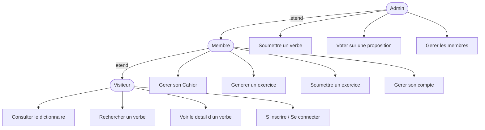
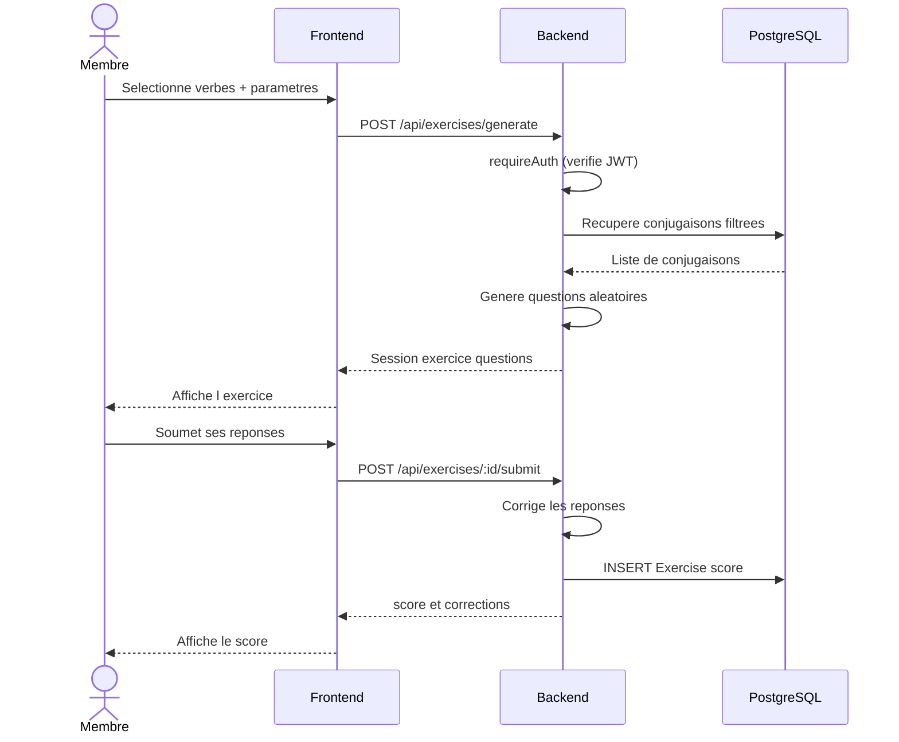
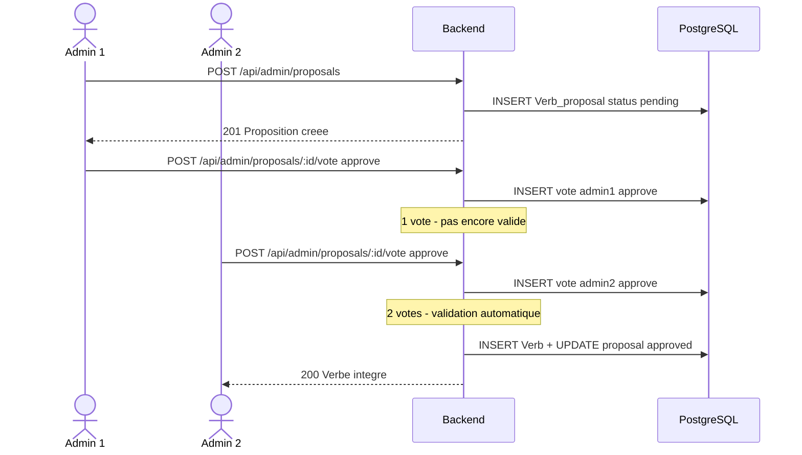
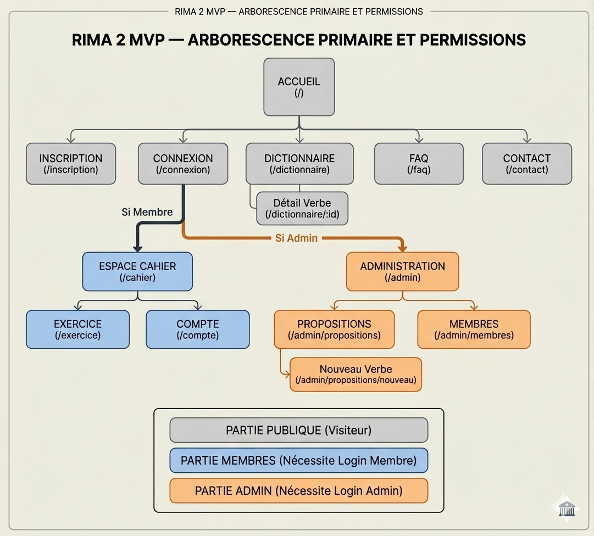
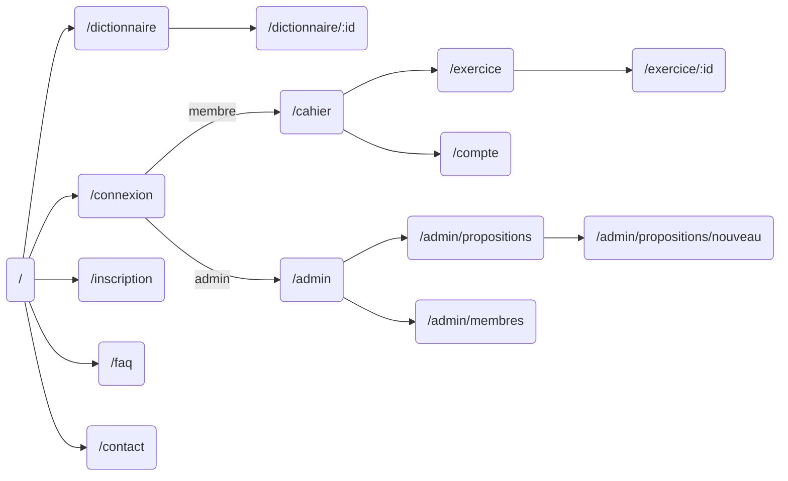
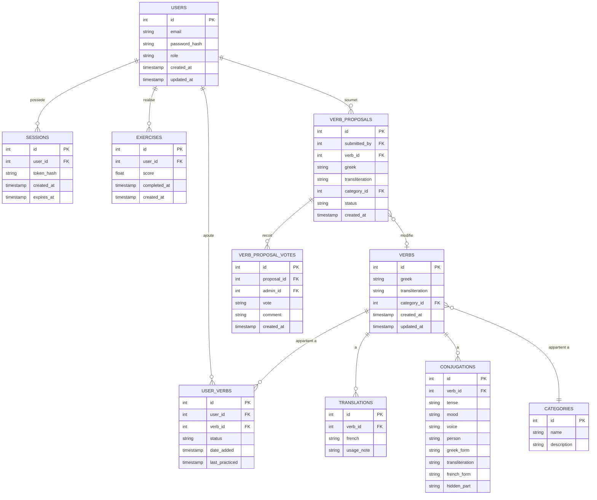

# Cahier des Charges — Projet RIMA 2

> **Version :** 1.2  
> **Date :** Mars 2026  
> **Auteur :** Valentin  
> **Statut :** MVP en cours

---

## Table des matières

1. [Présentation générale](#1-présentation-générale)
2. [Public cible et besoins](#2-public-cible-et-besoins)
3. [Rôles utilisateurs](#3-rôles-utilisateurs)
4. [User Stories](#4-user-stories)
5. [Cas d'utilisation (Use Cases)](#5-cas-dutilisation-use-cases)
6. [Périmètre fonctionnel](#6-périmètre-fonctionnel)
7. [Architecture et stack technique](#7-architecture-et-stack-technique)
8. [Arborescence du site](#8-arborescence-du-site)
9. [Modélisation des données](#9-modélisation-des-données)
10. [Spécifications API](#10-spécifications-api)
11. [Sécurité](#11-sécurité)
12. [Analyse des risques](#12-analyse-des-risques)
13. [Feuille de route](#13-feuille-de-route)
14. [Évolutions futures](#14-évolutions-futures)

---

## 1. Présentation générale

**RIMA 2** est une application web interactive dédiée à l'apprentissage des conjugaisons du grec moderne. Contrairement aux outils généralistes, RIMA 2 se base sur un **Cahier personnel** : l'utilisateur construit son propre dictionnaire à partir d'une base de données riche, puis génère des exercices sur-mesure à partir de sa sélection.

L'application vise à transformer l'apprentissage rébarbatif des verbes en une expérience dynamique et structurée, permettant de suivre sa progression temps par temps, voix par voix.


---

## 2. Public cible et besoins

### Public cible

- **Linguistes autodidactes** : Passionnés par les langues cherchant un outil rigoureux
- **Étudiants** : Apprenants ayant besoin de réviser des groupes de conjugaisons spécifiques

### Besoins identifiés

| Besoin (problème identifié) | Objectif (solution apportée) |
|---|---|
| Difficulté de mémoriser les nombreuses formes verbales du grec (voix, modes, temps) | Moteur d'exercices aléatoires ciblant précisément les conjugaisons sélectionnées |
| Les dictionnaires classiques ne permettent pas de tester ses connaissances activement | Système de "Cahier" personnel pour transformer le lexique en exercices |
| Manque de suivi dans l'apprentissage des verbes | Système de statuts (to_learn, learning, mastered) et score de progression |
| Besoin d'une source de données fiable et collaborative | Workflow d'administration avec système de vote pour valider les nouveaux verbes |

---

## 3. Rôles utilisateurs

### Visiteur (non connecté)
Accès en lecture seule aux contenus publics.

### Membre (connecté)
Accès à toutes les fonctionnalités personnalisées : cahier, exercices, compte.

### Admin
Accès à la gestion du contenu (verbes, membres) avec workflow de validation obligatoire, y compris pour les modifications de verbes déjà validés.

---

## 4. User Stories

### 👤 Visiteur

| En tant que visiteur, je souhaite... | Afin de... |
|---|---|
| Consulter le dictionnaire principal | Trouver la traduction d'un verbe |
| Rechercher un verbe par mot-clé (grec ou français) | Trouver rapidement une traduction ou une forme |
| Accéder au détail d'un verbe et ses conjugaisons complètes | Consulter toutes les formes d'un verbe |
| Filtrer les verbes par catégorie | Réviser un groupe spécifique |
| Accéder aux pages statiques (Homepage, FAQ, Contact) | M'informer sur l'application |
| Créer un compte | Accéder aux fonctionnalités membres |
| Me connecter | Retrouver mon espace personnel |

### 📚 Membre

| En tant que membre, je souhaite... | Afin de... |
|---|---|
| Faire tout ce que fait un visiteur | — |
| Voir le statut d'apprentissage d'un verbe directement dans le dictionnaire | Savoir quels verbes j'ai déjà travaillés |
| Ajouter un verbe à mon Cahier | Construire ma liste de révision personnelle |
| Retirer un verbe de mon Cahier | Maintenir mon cahier à jour |
| Modifier le statut d'un verbe (to_learn / learning / mastered) | Suivre l'évolution de mon apprentissage |
| Filtrer mon Cahier par statut, catégorie et langue | Organiser et retrouver mes verbes facilement |
| Générer un exercice depuis mon Cahier en choisissant les verbes, la langue, les temps/modes/voix et le type d'exercice | Pratiquer activement les conjugaisons qui me posent problème |
| Répondre à un exercice et voir mon score | Évaluer ma progression |
| Modifier mon mot de passe | Sécuriser mon compte |
| Réinitialiser mon mot de passe par email | Récupérer l'accès à mon compte |
| Supprimer mon compte | Exercer mon droit à l'oubli |
| Me déconnecter de tous mes appareils | Sécuriser mon compte en cas de perte d'accès |

### 🔧 Admin

| En tant qu'admin, je souhaite... | Afin de... |
|---|---|
| Faire tout ce que fait un membre | — |
| Soumettre un nouveau verbe avec ses conjugaisons complètes | Enrichir la base de données |
| Voter pour approuver ou rejeter un verbe proposé ou modifié | Garantir la qualité linguistique des données |
| Voir les verbes en attente de validation | Traiter les propositions en cours |
| Soumettre une modification d'un verbe existant (repasse par le vote) | Corriger une erreur ou enrichir les données |
| Supprimer un verbe existant | Maintenir la qualité de la base |
| Créer, modifier, supprimer un compte membre | Gérer la communauté |

> **Règle de validation :** Un verbe proposé ou modifié doit recevoir au minimum **2 votes d'approbation** d'admins différents avant d'être intégré ou mis à jour dans la base principale. Un verbe en attente de validation n'est pas visible des membres.

---

## 5. Cas d'utilisation (Use Cases)

### Diagramme global



### Diagramme de séquence — Génération d'exercice



### Diagramme de séquence — Workflow de validation admin



---

## 6. Périmètre fonctionnel

### MVP — Fonctionnalités incluses

- **Dictionnaire central** : Consultation, recherche, filtrage par catégorie, détail d'un verbe avec ses conjugaisons complètes
- **Authentification** : Signup, login, logout, réinitialisation mot de passe, déconnexion multi-appareils
- **Le Cahier** : Ajout/suppression de verbes, gestion des statuts, filtres et tri
- **Générateur d'exercices** : Texte à trou généré dynamiquement à partir de la sélection de l'utilisateur avec score en pourcentage
- **Gestion de contenu (Admin)** : Proposition de verbes, workflow de validation par vote, CRUD membres
- **Mon compte** : Modification et suppression de compte

### Types d'exercices (MVP)

- **Texte à trou** : La forme conjuguée complète est masquée. L'utilisateur doit retaper le mot entier, accent tonique compris.

> **Choix technique justifié :** Le grec moderne présente des contraintes linguistiques complexes (accent mobile, augment au passé, voyelles thématiques des verbes contractés) qui rendent la séparation automatique radical/terminaison non viable sans un moteur linguistique dédié. Stocker et masquer la forme complète est l'approche la plus robuste et la plus pertinente pédagogiquement pour le MVP.

### Types d'exercices (V2)

- **QCM** : Choisir la bonne forme parmi 4 propositions
- **Glisser-déposer** : Réorganiser des formes conjuguées
- **Conjugaison classique** : Saisir toute la table (je/tu/il...) d'un verbe à un temps donné

### Paramètres de génération d'exercice

L'utilisateur peut sélectionner :
- Les verbes concernés (depuis son Cahier)
- La langue (grec → français ou français → grec)
- Les temps, modes et voix souhaités
- Le type d'exercice

---

## 7. Architecture et stack technique

### Architecture

**Monolithe** pour la phase MVP afin de garantir une vélocité maximale en développement solo.

### Stack technique

| Composant | Technologie | Justification |
|---|---|---|
| Langage | TypeScript | Typage strict de bout en bout, crucial pour gérer les objets Verbes et Conjugaisons |
| Backend | Node.js + Express | Flexibilité des routes API, architecture controller/service éprouvée |
| Frontend | React | Interface réactive, écosystème riche |
| UI | Chakra UI | Design propre et accessible rapidement, composants prêts à l'emploi |
| Base de données | PostgreSQL | Puissance des relations pour lier Utilisateurs, Verbes et leurs multiples formes conjuguées |
| ORM | Prisma | Productivité accrue, migrations gérées, synchronisation parfaite avec les types TS |
| Client HTTP | Axios | Gestion simplifiée des erreurs, intercepteurs pour les tokens, gestion automatique du JSON |
| Auth | JWT + cookies HTTP-only | Sessions sécurisées, protection XSS |
| Sécurité | Token XSRF | Protection indispensable pour la gestion des cookies sur des domaines distincts (Render) |
| Validation | Zod | Garantie de l'intégrité des données entrantes (front et back) |
| Qualité | Husky | Automatisation des commits propres, respect de la convention Conventional Commits |
| Infrastructure | Docker | Environnement de développement et de déploiement ISO |
| Tests | Vitest | Tests unitaires sur la logique de génération et de correction des exercices |

### Architecture des dossiers

```
rima2/
├── backend/
│   ├── src/
│   │   ├── config/         # JWT, variables d'env
│   │   ├── controllers/    # Orchestration HTTP
│   │   ├── services/       # Logique metier + Prisma
│   │   ├── middlewares/    # Auth, erreurs, validation
│   │   ├── routes/         # Definition des routes Express
│   │   └── utils/          # Helpers, classes d'erreurs
│   ├── prisma/
│   │   └── schema.prisma   # Schema BDD
│   └── tests/
└── frontend/
    ├── src/
    │   ├── components/     # Composants reutilisables
    │   ├── pages/          # Pages React
    │   ├── hooks/          # Custom hooks
    │   ├── services/       # Appels API Axios
    │   └── types/          # Types TypeScript partages
    └── public/
```

---

## 8. Arborescence du site

[](<Cahier des charges.md>) 

### Pages publiques (Visiteur)

```
/                           Homepage
/dictionnaire               Liste des verbes
/dictionnaire/:id           Detail d'un verbe + conjugaisons
/connexion                  Page login
/inscription                Page signup
/mot-de-passe-oublie        Reinitialisation mdp
/faq                        FAQ
/contact                    Contact
```

### Pages membres (Membre connecté)

```
/cahier                     Mon Cahier
/exercice                   Generateur d'exercice
/exercice/:id               Session d'exercice en cours
/compte                     Mon compte
/compte/modifier            Modifier mot de passe / supprimer compte
```

### Pages admin (Admin connecté)

```
/admin                          Dashboard admin
/admin/propositions             Verbes en attente de validation
/admin/propositions/nouveau     Soumettre un verbe
/admin/membres                  Gestion des membres
```

### Schéma de navigation



---

## 9. Modélisation des données

### Décisions techniques clés

- **Traductions multiples** : Un verbe peut avoir plusieurs traductions françaises. Elles sont stockées dans une table `Translations` dédiée (relation 1-N) pour permettre des recherches précises par mot-clé.
- **Formes conjuguées** : Stockées en forme complète (pas de séparation radical/terminaison) pour les raisons linguistiques détaillées en section 6. Un champ `hidden_part` nullable est prévu pour la V2.
- **Exercices volatils** : Une session d'exercice ne persiste pas après soumission. Seul le score final est conservé.
- **Workflow de modification** : Toute modification d'un verbe existant par un admin crée une nouvelle `Verb_proposal` qui repasse par le circuit de vote (2 admins minimum).

### MCD — Modèle Conceptuel de Données



### MLD — Modèle Logique de Données

```sql
users (
  id              SERIAL        PRIMARY KEY,
  email           VARCHAR(255)  UNIQUE NOT NULL,
  password_hash   VARCHAR(255)  NOT NULL,
  role            VARCHAR(20)   DEFAULT 'member',
  created_at      TIMESTAMP     DEFAULT NOW(),
  updated_at      TIMESTAMP     DEFAULT NOW()
)

sessions (
  id              SERIAL        PRIMARY KEY,
  user_id         INT           NOT NULL REFERENCES users(id) ON DELETE CASCADE,
  token_hash      VARCHAR(255)  NOT NULL,
  created_at      TIMESTAMP     DEFAULT NOW(),
  expires_at      TIMESTAMP     NOT NULL
)

categories (
  id              SERIAL        PRIMARY KEY,
  name            VARCHAR(100)  NOT NULL,
  description     TEXT
)

verbs (
  id              SERIAL        PRIMARY KEY,
  greek           VARCHAR(255)  NOT NULL,
  transliteration VARCHAR(255),
  category_id     INT           REFERENCES categories(id),
  created_at      TIMESTAMP     DEFAULT NOW(),
  updated_at      TIMESTAMP     DEFAULT NOW()
)

translations (
  id              SERIAL        PRIMARY KEY,
  verb_id         INT           NOT NULL REFERENCES verbs(id) ON DELETE CASCADE,
  french          VARCHAR(255)  NOT NULL,
  usage_note      TEXT
)

conjugations (
  id              SERIAL        PRIMARY KEY,
  verb_id         INT           NOT NULL REFERENCES verbs(id) ON DELETE CASCADE,
  tense           VARCHAR(100),
  mood            VARCHAR(100),
  voice           VARCHAR(100),
  person          VARCHAR(50),
  greek_form      VARCHAR(255),
  transliteration VARCHAR(255),
  french_form     VARCHAR(255),
  hidden_part     VARCHAR(100)
)

user_verbs (
  id              SERIAL        PRIMARY KEY,
  user_id         INT           NOT NULL REFERENCES users(id) ON DELETE CASCADE,
  verb_id         INT           NOT NULL REFERENCES verbs(id) ON DELETE CASCADE,
  status          VARCHAR(20)   DEFAULT 'to_learn',
  date_added      TIMESTAMP     DEFAULT NOW(),
  last_practiced  TIMESTAMP,
  UNIQUE(user_id, verb_id)
)

exercises (
  id              SERIAL        PRIMARY KEY,
  user_id         INT           NOT NULL REFERENCES users(id) ON DELETE CASCADE,
  score           FLOAT,
  completed_at    TIMESTAMP,
  created_at      TIMESTAMP     DEFAULT NOW()
)

verb_proposals (
  id              SERIAL        PRIMARY KEY,
  submitted_by    INT           NOT NULL REFERENCES users(id),
  verb_id         INT           REFERENCES verbs(id),
  greek           VARCHAR(255),
  transliteration VARCHAR(255),
  category_id     INT           REFERENCES categories(id),
  status          VARCHAR(20)   DEFAULT 'pending',
  created_at      TIMESTAMP     DEFAULT NOW()
)

verb_proposal_votes (
  id              SERIAL        PRIMARY KEY,
  proposal_id     INT           NOT NULL REFERENCES verb_proposals(id) ON DELETE CASCADE,
  admin_id        INT           NOT NULL REFERENCES users(id),
  vote            VARCHAR(10)   NOT NULL,
  comment         TEXT,
  created_at      TIMESTAMP     DEFAULT NOW(),
  UNIQUE(proposal_id, admin_id)
)
```

---

## 10. Spécifications API

### Routes publiques

```
GET    /api/verbs                     Liste des verbes (avec filtres)
GET    /api/verbs/:id                 Detail d'un verbe
GET    /api/verbs/:id/conjugations    Conjugaisons d'un verbe
GET    /api/verbs/search              Recherche par mot-cle (grec ou francais)
GET    /api/categories                Liste des categories
POST   /api/auth/signup               Creation de compte
POST   /api/auth/login                Connexion
POST   /api/auth/forgot-password      Demande de reinitialisation
POST   /api/auth/reset-password       Reinitialisation mot de passe
```

### Routes membres *(requireAuth)*

```
GET    /api/auth/me                   Infos du user connecte
POST   /api/auth/logout               Deconnexion
DELETE /api/auth/sessions             Deconnexion tous appareils
PATCH  /api/auth/password             Modifier mot de passe
DELETE /api/auth/account              Supprimer compte

GET    /api/user-verbs                Mon Cahier (avec filtres)
POST   /api/user-verbs                Ajouter un verbe au Cahier
DELETE /api/user-verbs/:id            Retirer un verbe du Cahier
PATCH  /api/user-verbs/:id            Modifier le statut d'un verbe

POST   /api/exercises/generate        Generer une session d'exercice
POST   /api/exercises/:id/submit      Soumettre les reponses et obtenir le score
```

### Routes admin *(requireAuth + requireAdmin)*

```
POST   /api/admin/proposals           Soumettre un verbe (nouveau ou modification)
GET    /api/admin/proposals           Liste des propositions en attente
POST   /api/admin/proposals/:id/vote  Voter pour une proposition
DELETE /api/admin/verbs/:id           Supprimer un verbe
GET    /api/admin/users               Liste des membres
POST   /api/admin/users               Creer un membre
PATCH  /api/admin/users/:id           Modifier un membre
DELETE /api/admin/users/:id           Supprimer un membre
```

---

## 11. Sécurité

| Menace | Mesure |
|---|---|
| Vol de session (XSS) | JWT stocké en cookie HTTP-only (inaccessible au JavaScript) |
| CSRF | Token XSRF obligatoire sur toutes les requêtes mutantes (POST, PUT, PATCH, DELETE) |
| Injection SQL | Prisma (requêtes paramétrées, pas de SQL brut) |
| Mots de passe | Hachage Argon2 (irréversible, salé) |
| Brute force | Rate limiting sur les routes auth |
| Données invalides | Validation Zod côté backend sur toutes les entrées |
| Accès non autorisé | Middleware `requireAuth` + `requireAdmin` sur les routes protégées |
| Exposition de données sensibles | Jamais de `password_hash` dans les réponses API |

---

## 12. Analyse des risques

| Risque | Probabilité | Impact | Mesure préventive |
|---|---|---|---|
| Complexité des données (Verbe → Conjugaison) | Élevée | Élevé | Prisma + TypeScript pour ne jamais perdre le fil des relations |
| Régression lors d'une modification | Moyenne | Élevé | Tests unitaires Vitest sur la logique de génération et correction |
| Sécurité CSRF sur Render (3 domaines) | Élevée | Élevé | Token XSRF + configuration stricte des cookies (SameSite/Secure) |
| Éparpillement / hors scope | Élevée | Moyen | Respect strict de la feuille de route MVP |
| Qualité du code | Moyenne | Moyen | Husky + Conventional Commits + revues régulières |
| Algorithme de génération d'exercices complexe | Faible | Faible | Forme complète stockée en BDD, masquage du mot entier en MVP |

---

## 13. Feuille de route

### Phase 1 — Fondations & Sécurité
- [x] Husky + Conventional Commits configurés
- [x] Architecture dossiers back + front
- [ ] Configuration Docker + PostgreSQL
- [ ] Schéma Prisma complet (toutes les entités)
- [ ] Système d'auth (JWT + XSRF + cookies HTTP-only)
- [ ] Gestion des sessions multi-appareils
- [ ] Middleware requireAuth + requireAdmin

### Phase 2 — Core Business (Le Dictionnaire)
- [ ] CRUD Verbes, Traductions et Conjugaisons (Admin)
- [ ] Workflow de validation par vote
- [ ] Routes publiques dictionnaire (liste, détail, recherche, filtres)
- [ ] Frontend : pages dictionnaire + recherche

### Phase 3 — Le Cahier & Exercices
- [ ] CRUD User_verbs (Cahier personnel)
- [ ] Filtres et tri du Cahier
- [ ] Algorithme de génération d'exercice (texte à trou — forme complète)
- [ ] Soumission et calcul du score
- [ ] Frontend : pages Cahier + Exercice

### Phase 4 — Compte & Qualité
- [ ] Pages Mon Compte (modification, suppression, réinitialisation mdp)
- [ ] Déconnexion multi-appareils
- [ ] Tests unitaires Vitest (logique exercices)
- [ ] Finalisation composants Chakra UI
- [ ] Déploiement sur Render

---

## 14. Évolutions futures

### V2
- Dashboard de progression visuel (graphiques, statistiques)
- Nouveaux types d'exercices : QCM, glisser-déposer, conjugaison classique complète
- Champ `hidden_part` dans `Conjugations` pour masquer uniquement la terminaison
- Bloc-notes personnel (texte riche : gras, italique, listes)
- Historique des exercices consultable
- Intégration IA pour aide à la traduction
- Étymologies des verbes
- Refresh token (sessions longue durée)

### V3
- Remplissage massif de la base (scraping ou import CSV)
- Application mobile (React Native)
- Mode hors-ligne

---

*Document généré dans le cadre du projet RIMA 2 — Application d'apprentissage du grec moderne.*  
*Dernière mise à jour : Mars 2026 — v1.2*