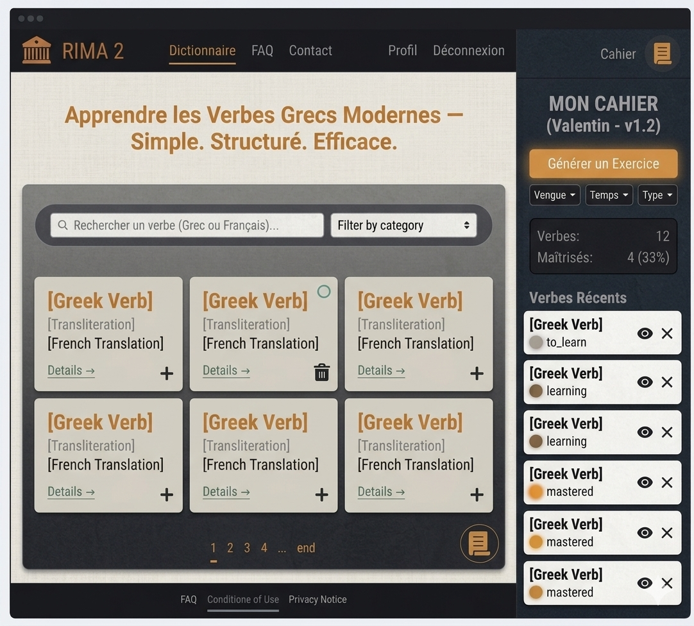

# Design System — RIMA 2

> **Version :** 1.0  
> **Date :** Avril 2026  
> **Auteur :** Valentin  
> **Statut :** MVP

---

## Table des matières

1. [Identité visuelle](#1-identité-visuelle)
2. [Palette de couleurs](#2-palette-de-couleurs)
3. [Typographie](#3-typographie)
4. [Tokens Chakra UI](#4-tokens-chakra-ui)
5. [Composants clés](#5-composants-clés)
6. [UX — Comportements et états](#6-ux--comportements-et-états)
7. [Responsive](#7-responsive)
8. [Références visuelles](#8-références-visuelles)

---

## 1. Identité visuelle


Image générée avec une palette de couleurs donnée et le wireframe pour un premier apperçu (sans les polices/hover et autres effets...)

### Concept

**"L'Atelier"** — Une interface sobre et concentrée qui évoque les carnets de terrain, les poteries grecques et la rigueur des études linguistiques. Le design n'est pas un obstacle à l'apprentissage, il l'accompagne discrètement.

### Principes directeurs

- **Sobriété** : Pas de couleurs criardes. L'ocre cuivré est le seul élément lumineux — il guide l'œil vers les actions.
- **Chaleur** : Les tons parchemin/pierre remplacent le blanc clinique habituel.
- **Lisibilité avant tout** : Le grec moderne a des caractères complexes. La typographie doit être irréprochable.
- **Texture** : Un fond légèrement texturé (papier/lin) rappelle les carnets de terrain. Peut être implémenté via une image SVG ou CSS subtle pattern.

### Ambiance

Inspirée des céramiques grecques antiques — ocre, terre cuite, argile grise — transposée dans une interface moderne et fonctionnelle.

---

## 2. Palette de couleurs

### Backgrounds

| Rôle | Hex | Usage |
|---|---|---|
| Background principal | `#E8E4DC` | Page entière (parchemin/lin) |
| Background secondaire | `#D6D1C7` | Cartes, sidebar, modales |
| Background tertiaire | `#C8C2B8` | Inputs, éléments enfoncés |

> **Note texture :** Le background principal peut utiliser une texture subtile CSS (`noise` ou SVG pattern) pour évoquer le papier/lin. Intensité très faible (opacity 0.04 max).

### Textes

| Rôle | Hex | Usage |
|---|---|---|
| Texte principal | `#2C2A26` | Corps de texte, titres |
| Texte secondaire | `#6B6560` | Labels, placeholders, métadonnées |
| Texte tertiaire | `#9B958E` | Infos désactivées, hints |

### Couleur primaire / CTA

| État | Hex | Usage |
|---|---|---|
| Normal | `#C4843A` | Boutons CTA, liens actifs, verbe grec |
| Hover | `#A86B2C` | Survol du CTA |
| Active | `#8E5820` | Clic du CTA |
| Fond doux | `#F5EBD8` | Background de badge, tag |

### Statuts sémantiques

| Rôle | Hex | Justification |
|---|---|---|
| Succès | `#5C7A6B` | Vert sauge — validation discrète et organique |
| Erreur | `#8E443D` | Brique foncée — non agressive |
| Warning | `#9B7B4E` | Bronze — même famille que learning |
| Info | `#6B7A8E` | Ardoise bleue — neutre |

### Pastilles d'apprentissage — "La lueur"

Concept : la pastille s'allume progressivement, comme une flamme qui prend.

| Statut | Hex pastille | Hex texte | Sémantique |
|---|---|---|---|
| `to_learn` | `#B5AFA6` | `#6B6560` | Argile sèche — éteinte |
| `learning` | `#9B7B4E` | `#5C3D1E` | Bronze mat — la chaleur commence |
| `mastered` | `#C4843A` | `#5C3010` | Ocre cuivré — brille comme le CTA |

### Bordures

| Rôle | Valeur |
|---|---|
| Bordure par défaut | `1px solid rgba(44, 42, 38, 0.12)` |
| Bordure hover | `1px solid rgba(44, 42, 38, 0.25)` |
| Bordure focus | `2px solid #C4843A` |

---

## 3. Typographie

### Concept — Règle des 3 rôles

Trois polices, chacune avec un territoire précis. Jamais interchangeables.

| Police | Google Fonts | Rôle | Ne jamais utiliser pour... |
|---|---|---|---|
| **Cinzel** | `Cinzel` | Logo + grands titres de sections (H1, H2) | Le body text — illisible en petit |
| **Lato** | `Lato` | Tout le reste (dictionnaire, verbes, UI, instructions) | Les éléments identitaires |
| **Handlee** | `Handlee` | Titre "MON CAHIER" + notes personnelles | Tout texte fonctionnel |

### Import Google Fonts

```html
<link href="https://fonts.googleapis.com/css2?family=Cinzel:wght@400;600&family=Lato:ital,wght@0,300;0,400;0,700;1,400&family=Handlee&display=swap" rel="stylesheet">
```

### Échelle typographique

| Élément | Police | Taille | Poids | Usage |
|---|---|---|---|---|
| Logo RIMA | Cinzel | 20px | 600 | Navbar |
| H1 — Héro | Cinzel | 28-32px | 600 | Titre page principale |
| H2 — Section | Cinzel | 22px | 400 | Titre de section |
| Titre cahier | Handlee | 18px | 400 | "MON CAHIER" dans sidebar |
| Corps principal | Lato | 16px | 400 | Texte courant |
| Verbe grec | Lato | 18px | 700 | Affichage du verbe grec |
| Translittération | Lato | 14px | 300 italic | Sous le verbe grec |
| Traduction FR | Lato | 14px | 400 | Sous la translittération |
| Label UI | Lato | 13px | 400 | Labels, filtres, navigation |
| Hint / Helper | Lato | 12px | 400 | Placeholders, métadonnées |

### Line-height

```
Corps : 1.6
Titres : 1.2
Labels UI : 1.4
```

---

## 4. Tokens Chakra UI

### Configuration du thème

```typescript
// frontend/src/theme/index.ts
import { extendTheme } from '@chakra-ui/react'

const theme = extendTheme({
  colors: {
    brand: {
      50:  '#F5EBD8',
      100: '#EDD4A8',
      200: '#E0BB78',
      300: '#D4A050',
      400: '#C4843A',
      500: '#A86B2C',
      600: '#8E5820',
      700: '#724416',
      800: '#56320E',
      900: '#3A2108',
    },
    parchment: {
      50:  '#F5F3EF',
      100: '#E8E4DC',
      200: '#D6D1C7',
      300: '#C8C2B8',
      400: '#B5AFA6',
      500: '#9B958E',
      600: '#827B74',
      700: '#6B6560',
      800: '#4A4540',
      900: '#2C2A26',
    },
    status: {
      toLearn:  '#B5AFA6',
      learning: '#9B7B4E',
      mastered: '#C4843A',
      success:  '#5C7A6B',
      error:    '#8E443D',
    }
  },
  fonts: {
    heading: "'Cinzel', serif",
    body: "'Lato', sans-serif",
    mono: "'Lato', sans-serif",
  },
  fontSizes: {
    xs:  '12px',
    sm:  '13px',
    md:  '14px',
    lg:  '16px',
    xl:  '18px',
    '2xl': '22px',
    '3xl': '28px',
    '4xl': '32px',
  },
  styles: {
    global: {
      body: {
        bg: '#E8E4DC',
        color: '#2C2A26',
        fontFamily: "'Lato', sans-serif",
      },
      '::selection': {
        bg: '#C4843A',
        color: 'white',
      }
    }
  },
  components: {
    Button: {
      variants: {
        primary: {
          bg: '#C4843A',
          color: 'white',
          fontFamily: "'Lato', sans-serif",
          fontWeight: '700',
          _hover: { bg: '#A86B2C' },
          _active: { bg: '#8E5820' },
        },
        ghost: {
          color: '#C4843A',
          _hover: { bg: '#F5EBD8' },
        }
      },
      defaultProps: { variant: 'primary' }
    },
    Input: {
      variants: {
        filled: {
          field: {
            bg: '#D6D1C7',
            border: '1px solid transparent',
            _hover: { bg: '#C8C2B8' },
            _focus: { bg: '#D6D1C7', borderColor: '#C4843A' },
          }
        }
      },
      defaultProps: { variant: 'filled' }
    },
    Card: {
      baseStyle: {
        container: {
          bg: '#D6D1C7',
          border: '1px solid rgba(44, 42, 38, 0.12)',
          borderRadius: '10px',
          _hover: {
            border: '1px solid rgba(44, 42, 38, 0.25)',
            transform: 'translateY(-1px)',
            transition: 'all 0.15s ease',
          }
        }
      }
    }
  },
  radii: {
    sm: '4px',
    md: '8px',
    lg: '10px',
    xl: '14px',
    pill: '999px',
  },
  shadows: {
    card: '0 1px 3px rgba(44, 42, 38, 0.08)',
    sidebar: '2px 0 8px rgba(44, 42, 38, 0.10)',
  }
})

export default theme
```

---

## 5. Composants clés

### Carte Verbe

```
┌─────────────────────────────┐
│ ● [pastille statut]         │  ← visible seulement si membre connecté
│                             │
│ αγαπάω              [+] [🗑] │  ← [+] = ajouter au cahier / [🗑] = retirer
│ agapáo (italic)             │  ← translittération (Lato 14px italic 300)
│ aimer, apprécier            │  ← traduction FR (Lato 14px 400)
│                             │
│ Détails →                   │  ← lien CTA (couleur brand)
└─────────────────────────────┘
```

**États de la carte :**
- `default` : bg `#D6D1C7`, bordure transparente
- `hover` : bordure `rgba(44,42,38,0.25)`, légère élévation
- `in-cahier` : bordure gauche `3px solid #C4843A`
- `selection-mode` : checkbox apparaît, hover change le curseur

### Pastille de statut

```
● à apprendre    → dot #B5AFA6, texte #6B6560
● en cours       → dot #9B7B4E, texte #5C3D1E
● maîtrisé       → dot #C4843A, texte #5C3010
```

Taille du dot : 10px, border-radius 50%.  
Font : Lato 12px.

### Sidebar "Mon Cahier"

```
┌──────────────────────────┐
│  [✕]    MON CAHIER       │  ← Handlee 18px + bouton fermeture
│         (Valentin)       │  ← Handlee 14px italic, couleur secondaire
├──────────────────────────┤
│ [ 12 verbes ] [ 4 (33%)] │  ← 2 metric cards côte à côte
├──────────────────────────┤
│ 🔍 Rechercher...         │  ← Input Lato 13px
│ [Catégorie ▼] [Statut ▼] │  ← Select filters
├──────────────────────────┤
│ —— Groupe A ——           │  ← Séparateur de catégorie (Lato 11px)
│ ● αγαπάω  [👁] [✕]      │
│ ● γράφω   [👁] [✕]      │
│ ● λέω     [👁] [✕]      │
│ —— Groupe B ——           │
│ ● ...                    │
│                          │
│ [Générer un exercice]    │  ← CTA full-width, Lato 14px bold
└──────────────────────────┘
```

**Comportement :**
- Pousse le layout (pas d'overlay) sauf sur mobile
- Largeur fixe : `280px`
- Background : `#C8C2B8` (plus sombre que le body)
- Box-shadow : `2px 0 8px rgba(44,42,38,0.10)` côté gauche du contenu

### Bouton "Générer un exercice" — ses 3 états

```
État 1 — Normal :
[ Générer un exercice ]
→ bg #C4843A, texte blanc, Lato 14px bold

État 2 — Mode sélection activé :
[ ✓ 3 verbes sélectionnés — Continuer → ]
→ même style + compteur dynamique

État 3 — 0 verbes sélectionnés :
[ Sélectionnez au moins un verbe ]
→ bg #B5AFA6 (désactivé), texte #6B6560, cursor not-allowed
```

### Modale — Paramètres d'exercice

```
┌────────────────────────────────┐
│ Paramètres de l'exercice       │  ← Cinzel 18px
│                                │
│ Langue      [Grec → FR ▼]     │
│ Type        [Texte à trou ▼]  │
│ Temps       [Tous ▼]          │
│ Voix        [Active ▼]        │
│ Mode        [Indicatif ▼]     │
│                                │
│ [Annuler]    [Lancer →]       │
└────────────────────────────────┘
```

### Pop-up visiteur (clic sur "+")

```
┌────────────────────────────────┐
│  Vous devez être connecté      │  ← Lato 15px
│  pour ajouter des verbes       │
│  à votre Cahier.               │
│                                │
│  [Se connecter]  [S'inscrire]  │
└────────────────────────────────┘
```

---

## 6. UX — Comportements et états

### Navigation — états connecté / déconnecté

```
Visiteur :
Navbar → Logo | Dictionnaire | FAQ | Contact | [Se connecter] [S'inscrire]

Membre connecté :
Navbar → Logo | Dictionnaire | FAQ | Contact | Profil | [Déconnexion] | [Cahier 📋]

Admin connecté :
Navbar → Logo | Dictionnaire | FAQ | Contact | Admin | Profil | [Déconnexion] | [Cahier 📋]
```

### Feedback des interactions

| Action | Feedback |
|---|---|
| Ajouter au cahier (membre) | Pastille apparaît sur la carte + toast succès |
| Ajouter au cahier (visiteur) | Pop-up "connectez-vous" |
| Retirer du cahier | Toast confirmation + pastille disparaît |
| Modifier statut | Pastille change de couleur avec transition 0.2s |
| Erreur de formulaire | Bordure rouge + message sous le champ (Lato 12px) |
| Succès de formulaire | Toast vert en haut à droite, disparaît après 3s |

### Mode sélection dans la sidebar

1. Clic "Générer un exercice" → checkboxes apparaissent à gauche de chaque ligne
2. Sélection de verbes → compteur se met à jour dans le bouton
3. 0 verbes → bouton désactivé
4. 1+ verbes → bouton actif "X verbes sélectionnés — Continuer →"
5. Clic "Continuer" → modale paramètres s'ouvre
6. Clic ailleurs (hors sélection/modale) → mode sélection se ferme

### Transitions

```css
/* Transitions standards */
transition: all 0.15s ease;          /* Hover états */
transition: transform 0.2s ease;     /* Élévation cartes */
transition: opacity 0.2s ease;       /* Apparition/disparition */
transition: width 0.3s ease;         /* Ouverture sidebar */
```

---

## 7. Responsive

### Breakpoints (Chakra UI defaults)

```
sm  : 480px   → Mobile large
md  : 768px   → Tablette
lg  : 992px   → Desktop petit
xl  : 1280px  → Desktop standard
2xl : 1536px  → Desktop large
```

### Comportement par breakpoint

**Mobile (< 768px)**
- Navbar → burger menu (hamburger icon)
- Grille verbes → 1 colonne
- Sidebar → drawer overlay (plein écran, slide from right)
- Bouton cahier flottant en bas à droite (FAB)
- Carousel vertical dans le dictionnaire

**Tablette (768px - 992px)**
- Grille verbes → 2 colonnes
- Sidebar → overlay partiel (60% de largeur)
- Navbar complète visible

**Desktop (> 992px)**
- Grille verbes → 3 colonnes
- Sidebar → pousse le layout (280px fixe)
- Layout deux zones : contenu + sidebar

---

## 8. Références visuelles

### Moodboard

L'esthétique s'inspire de :
- Céramiques grecques antiques (ocre, terre cuite, argile)
- Carnets de terrain d'archéologue (papier texturé, encre brune)
- Applications académiques modernes (sobriété, lisibilité)

### Wireframes

Les wireframes sont disponibles dans le dossier `docs/wireframes/` :
- `homepage-desktop.png` — Vue desktop sans sidebar
- `homepage-desktop-sidebar.png` — Vue desktop avec sidebar ouverte
- `homepage-mobile.png` — Vue mobile

### Références couleurs

Les maquettes Gemini dans ce dossier (`docs/maquettes/`) illustrent l'esprit général de l'interface avec la palette sombre. La palette finale retenue est la version claire (parchemin/lin) détaillée en section 2.

---

*Document de référence design — RIMA 2*  
*Dernière mise à jour : Avril 2026 — v1.0*